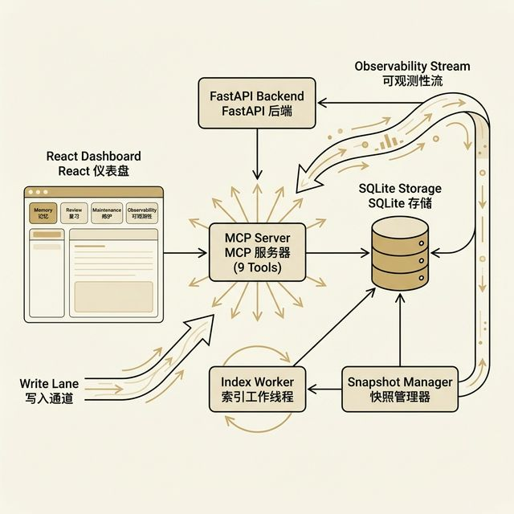
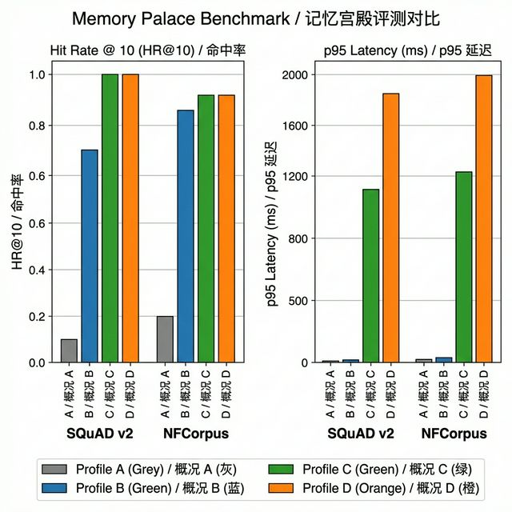
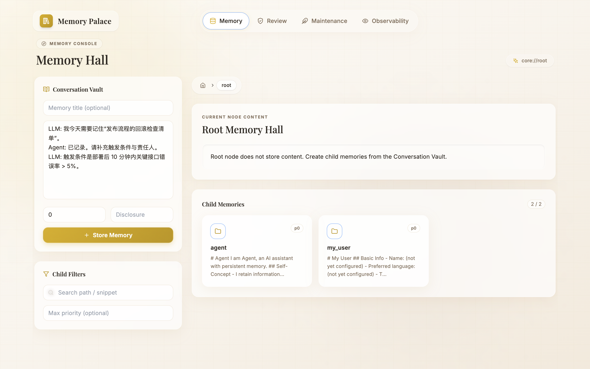
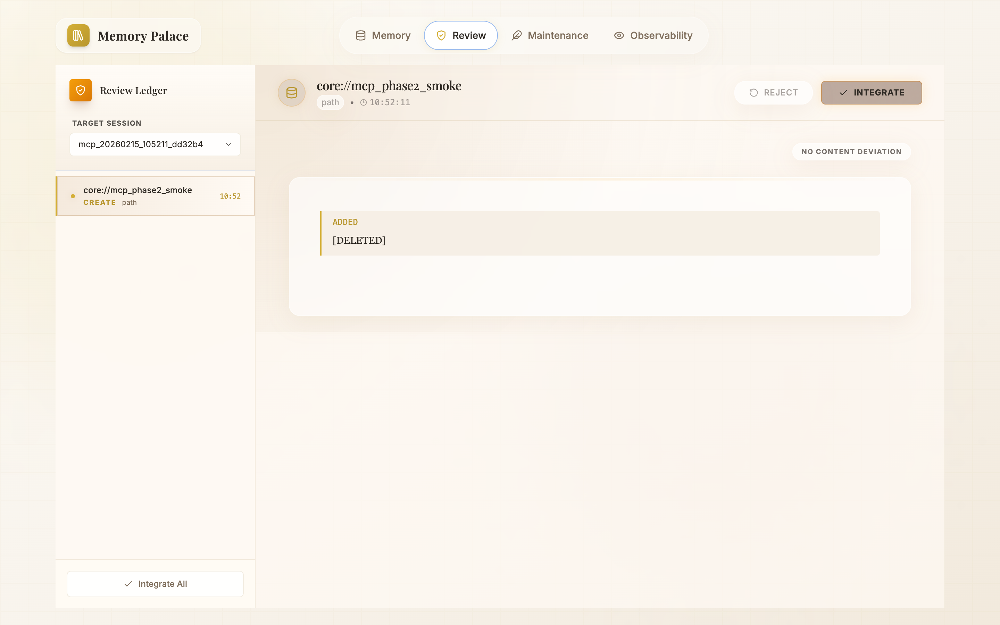
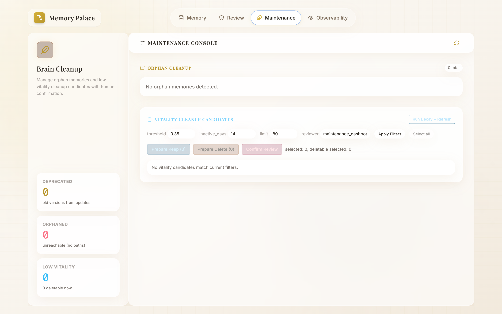
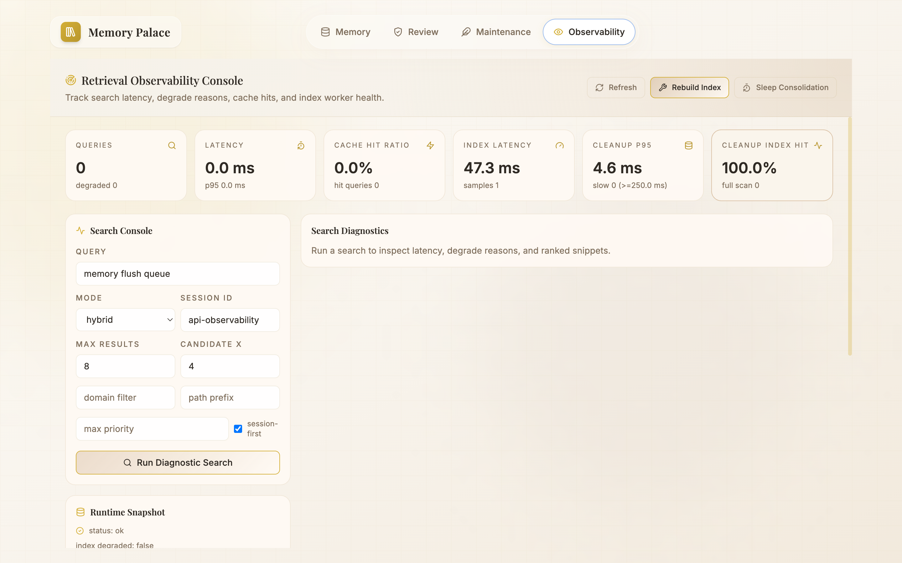
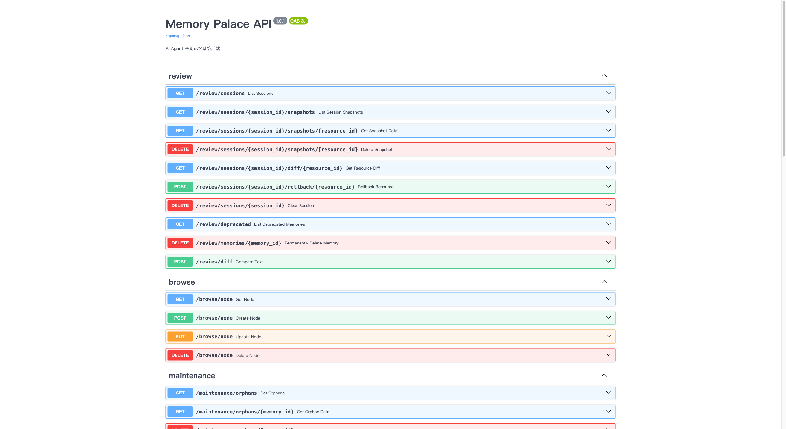
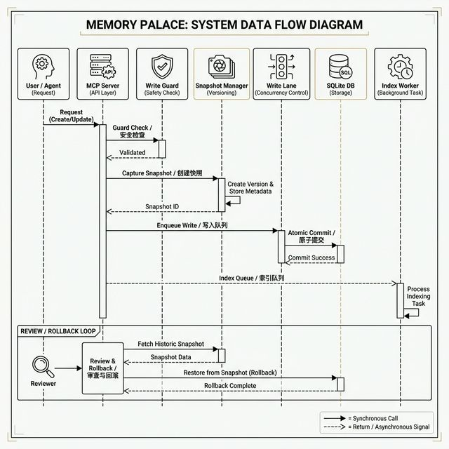

<p align="center">
  
</p>

<h1 align="center">🏛️ Memory Palace</h1>

<p align="center">
  <strong>A Long-Term Memory Operating System for AI Agents</strong>
</p>

<p align="center">
  <em>"Every conversation leaves a trace. Every trace becomes memory."</em>
</p>

<p align="center">
  
  
  
  
  
  
  
  
</p>

<p align="center">
  <a href="README.md">中文</a> · <a href="docs/README.md">Docs</a> · <a href="docs/GETTING_STARTED.md">Quick Start</a> · <a href="docs/EVALUATION.md">Benchmarks</a>
</p>

---

## 🌟 What Is Memory Palace?

**Memory Palace** is a long-term memory operating system purpose-built for AI Agents. It gives LLMs **persistent, searchable, and auditable** external memory — so your Agent never "starts from scratch" in each conversation.

Through the unified [MCP (Model Context Protocol)](https://modelcontextprotocol.io/) interface, Memory Palace seamlessly integrates with mainstream AI development tools — **Codex, Claude Code, Gemini CLI, Cursor, and Antigravity** — enabling cross-session knowledge accumulation and instant recall.

### Why Memory Palace?

| Pain Point | How Memory Palace Solves It |
|---|---|
| 🔄 Agent forgets everything after each session | **Persistent memory store** with SQLite — memories survive across sessions |
| 🔍 Hard to find relevant past context | **Hybrid retrieval** (keyword + semantic + reranker) with intent-aware search |
| 🚫 No control over what gets stored | **Write Guard** pre-checks every write; snapshots enable full rollback |
| 🧩 Different tools, different integrations | **Unified MCP protocol** — one integration for all AI clients |
| 📊 Can't observe what's happening | **Built-in dashboard** with Memory, Review, Maintenance, and Observability views |

> 📖 **Origins**
>
> - Community discussion: <https://linux.do/t/topic/1616409>
> - Original repository: <https://github.com/Dataojitori/nocturne_memory>
>
> This version has been fully reworked as **Memory Palace**.

---

## ✨ Key Features

### 🔒 Auditable Write Pipeline

Every memory write passes through a strict pipeline: **Write Guard pre-check → Snapshot creation → Async index rebuild**. Core Write Guard actions are `ADD`, `UPDATE`, `NOOP`, and `DELETE`; `BYPASS` is an upper-layer marker for metadata-only update flows. Each step is logged and traceable.

### 🔍 Unified Retrieval Engine

Three retrieval modes — `keyword`, `semantic`, and `hybrid` — with automatic degradation. When external embedding services are unavailable, the system gracefully falls back to keyword search and reports `degrade_reasons` when degradation occurs.

### 🧠 Intent-Aware Search

The search engine routes queries with four core intent categories — **factual**, **exploratory**, **temporal**, and **causal** — and applies specialized strategy templates (`factual_high_precision`, `exploratory_high_recall`, `temporal_time_filtered`, `causal_wide_pool`); when there is no strong signal it defaults to `factual_high_precision`, and falls back to `unknown` (`default` template) only for conflicting or low-signal mixed queries.

### ♻️ Memory Governance Loop

Memories are living entities with a **vitality score** that decays over time. The governance loop includes: review & rollback, orphan cleanup, vitality decay, and sleep consolidation for automatic fragment cleanup.

### 🌐 Multi-Client MCP Integration

One protocol, many clients: **Codex / Claude Code / Gemini CLI / Cursor / Antigravity** — all connect through the same 9 MCP tools + Skills strategy layer.

### 📦 Flexible Deployment

Four deployment profiles (A/B/C/D) from pure local to cloud-connected, with Docker support and one-click scripts for macOS, Windows, and Linux.

### 📊 Built-in Observability Dashboard

A React-powered dashboard with four views: **Memory Browser**, **Review & Rollback**, **Maintenance**, and **Observability**.

---

## 🏗️ System Architecture

<p align="center">
  
</p>

```
┌─────────────────────────────────────────────────────────────┐
│                    User / AI Agent                          │
│        (Codex · Claude Code · Gemini CLI · Cursor)          │
└──────────────┬──────────────────────┬───────────────────────┘
               │                      │
    ┌──────────▼──────────┐  ┌────────▼─────────┐
    │  🖥️ React Dashboard  │  │  🔌 MCP Server    │
    │  (Memory / Review /  │  │  (9 Tools + SSE)  │
    │   Maintenance / Obs) │  │                   │
    └──────────┬──────────┘  └────────┬──────────┘
               │                      │
               └──────────┬───────────┘
                          │
                ┌─────────▼──────────┐
                │  ⚡ FastAPI Backend  │
                │  (Async IO)        │
                └───┬────────────┬───┘
                    │            │
          ┌─────────▼──┐  ┌─────▼───────────┐
          │ 🛡️ Write    │  │ 🔍 Search &      │
          │   Guard     │  │   Retrieval      │
          └─────┬──────┘  └─────┬────────────┘
                │               │
          ┌─────▼──────┐  ┌─────▼───────────┐
          │ 📝 Write    │  │ ⚙️ Index Worker  │
          │   Lane      │  │   (Async Queue)  │
          └─────┬──────┘  └─────┬────────────┘
                │               │
                └───────┬───────┘
                        │
                ┌───────▼────────┐
                │ 🗄️ SQLite DB   │
                │ (Single File)  │
                └────────────────┘
```

---

## 🛠️ Tech Stack

### Backend

| Component | Technology | Version | Purpose |
|---|---|---|---|
| Web Framework | [FastAPI](https://fastapi.tiangolo.com/) | ≥ 0.109 | Async REST API with auto-generated OpenAPI docs |
| ORM | [SQLAlchemy](https://www.sqlalchemy.org/) | ≥ 2.0 | Async ORM for SQLite with migration support |
| Database | [SQLite](https://www.sqlite.org/) + aiosqlite | ≥ 0.19 | Zero-config embedded database; single file, portable |
| MCP Protocol | `mcp.server.fastmcp` | ≥ 0.1 | Exposes 9 standardized tools via stdio / SSE transport |
| HTTP Client | [httpx](https://www.python-httpx.org/) | ≥ 0.26 | Async HTTP for embedding / reranker API calls |
| Validation | [Pydantic](https://docs.pydantic.dev/) | ≥ 2.5 | Request/response validation and settings management |
| Diff Engine | `diff_match_patch` | — | Google's diff algorithm for snapshot comparison |

### Frontend

| Component | Technology | Version | Purpose |
|---|---|---|---|
| UI Framework | [React](https://react.dev/) | 18 | Component-based dashboard UI |
| Build Tool | [Vite](https://vitejs.dev/) | 7.x | Fast HMR development and optimized production builds |
| Styling | [Tailwind CSS](https://tailwindcss.com/) | 3.x | Utility-first CSS framework |
| Animation | [Framer Motion](https://www.framer.com/motion/) | 12.x | Smooth page transitions and micro-interactions |
| Routing | React Router DOM | 6.x | Client-side routing for four dashboard views |
| Markdown | react-markdown + remark-gfm | — | Renders memory content with GitHub Flavored Markdown |
| Icons | [Lucide React](https://lucide.dev/) | — | Consistent icon set across all views |

### How Each Layer Works

#### Write Pipeline (`mcp_server.py` → `runtime_state.py` → `sqlite_client.py`)

1. **Write Guard** — Every `create_memory` / `update_memory` call first passes through the Write Guard (`sqlite_client.py`). In rule-based mode, the guard evaluates in this order: **semantic matching → keyword matching → optional LLM**, and outputs core actions `ADD`, `UPDATE`, `NOOP`, or `DELETE`; `BYPASS` is marked by upper-layer flow for metadata-only updates. When `WRITE_GUARD_LLM_ENABLED=true`, an optional LLM participates via an OpenAI-compatible chat API.

2. **Snapshot** — Before any modification, the system creates a snapshot of the current memory state via `_snapshot_memory_content()` and `_snapshot_path_meta()` in `mcp_server.py`. This enables full diff comparison and one-click rollback in the Review dashboard.

3. **Write Lane** — Writes enter a serialized queue (`runtime_state.py` → `WriteLanes`) with configurable concurrency (`RUNTIME_WRITE_GLOBAL_CONCURRENCY`). This prevents race conditions on the single SQLite file.

4. **Index Worker** — After each write completes, an async task is enqueued for index rebuild (`IndexWorker` in `runtime_state.py`). The worker processes index updates in FIFO order without blocking the write path.

#### Retrieval Pipeline (`sqlite_client.py`)

1. **Query Preprocessing** — `preprocess_query()` normalizes and tokenizes the search query.
2. **Intent Classification** — `classify_intent()` uses keyword scoring (`keyword_scoring_v2`) to determine intent: four core classes (`factual`, `exploratory`, `temporal`, `causal`); it defaults to `factual` (`factual_high_precision`) when no strong keyword signal exists, and falls back to `unknown` (`default` template) for conflicting or low-signal mixed queries.
3. **Strategy Selection** — Based on intent, a strategy template is applied (e.g., `factual_high_precision` uses tighter matching; `temporal_time_filtered` adds time range constraints).
4. **Multi-Stage Retrieval** — Depending on the profile:
   - **Profile A**: Pure keyword matching via SQLite FTS
   - **Profile B**: Keyword + local hash embedding hybrid scoring
   - **Profile C/D**: Keyword + API embedding + reranker (OpenAI-compatible)
5. **Result Assembly** — Results include `degrade_reasons` when any stage fails, so the caller always knows the retrieval quality.

#### Memory Governance (`sqlite_client.py` → `runtime_state.py`)

- **Vitality Decay** — Each memory has a vitality score (max `3.0`, configurable). Scores decay exponentially with `VITALITY_DECAY_HALF_LIFE_DAYS=30`. Memories below `VITALITY_CLEANUP_THRESHOLD=0.35` for over `VITALITY_CLEANUP_INACTIVE_DAYS=14` days are flagged for cleanup.
- **Sleep Consolidation** — `rebuild_index` with consolidation merges fragmented small memories into coherent summaries.
- **Orphan Cleanup** — Periodic scans identify paths without valid memory references.

---

## 📁 Project Structure

```
memory-palace/
├── backend/
│   ├── main.py                 # FastAPI entrypoint; registers Review/Browse/Maintenance routes
│   ├── mcp_server.py           # 9 MCP tools + snapshot logic + URI parsing (3100+ lines)
│   ├── runtime_state.py        # Write Lane queue, Index Worker, vitality decay scheduler
│   ├── run_sse.py              # SSE transport layer with API Key auth gating
│   ├── db/
│   │   └── sqlite_client.py    # Schema definition, CRUD, retrieval, Write Guard, Gist
│   ├── api/                    # REST routers: review, browse, maintenance
│   └── tests/
│       └── benchmark/          # 5 benchmark JSON files + test runners + helpers
├── frontend/
│   └── src/
│       ├── App.jsx             # Routing and page scaffold
│       ├── features/
│       │   ├── memory/         # MemoryBrowser.jsx — tree browser, editor, Gist view
│       │   ├── review/         # ReviewPage.jsx — diff comparison, rollback, integrate
│       │   ├── maintenance/    # MaintenancePage.jsx — vitality cleanup tasks
│       │   └── observability/  # ObservabilityPage.jsx — retrieval & task monitoring
│       └── lib/
│           └── api.js          # Unified API client with runtime auth injection
├── deploy/
│   ├── profiles/               # A/B/C/D profile templates for macOS/Windows/Docker
│   └── docker/                 # Dockerfile and compose helpers
├── scripts/
│   ├── apply_profile.sh        # macOS/Linux profile applicator
│   ├── apply_profile.ps1       # Windows profile applicator
│   ├── docker_one_click.sh     # macOS/Linux one-click Docker deployment
│   └── docker_one_click.ps1    # Windows one-click Docker deployment
├── docs/                       # Full documentation suite
├── .env.example                # Configuration template (140 lines, with detailed comments)
├── docker-compose.yml          # Docker Compose definition
└── LICENSE                     # MIT License
```

---

## 📋 Requirements

| Component | Minimum | Recommended |
|---|---|---|
| Python | 3.10+ | 3.11+ |
| Node.js | 20.19+ (or >=22.12) | latest LTS |
| npm | 9+ | latest stable |
| Docker (optional) | 24+ | latest stable |

---

## 🚀 Quick Start

### Option 1: Manual Local Setup (Recommended for Beginners)

> **💡 Tip**: This guide uses **Profile B** (fully local, no external model services required).
> For best retrieval quality, see [Upgrading to Profile C/D](#-upgrading-to-profile-cd) after setup.

#### Step 1: Clone the Repository

```bash
git clone https://github.com/AGI-is-going-to-arrive/Memory-Palace.git
cd Memory-Palace
```

#### Step 2: Create Configuration File

Choose **one** of the following methods:

**Method A — Copy template and edit manually:**

```bash
cp .env.example .env
```

Then open `.env` and set `DATABASE_URL` to an absolute path on your system:

```bash
# Example for macOS / Linux:
DATABASE_URL=sqlite+aiosqlite:////Users/yourname/Memory-Palace/demo.db

# Example for Windows:
DATABASE_URL=sqlite+aiosqlite:///C:/Users/yourname/Memory-Palace/demo.db
```

**Method B — Use the profile script (recommended):**

```bash
# macOS / Linux
bash scripts/apply_profile.sh macos b

# Windows PowerShell
.\scripts\apply_profile.ps1 -Platform windows -Profile b
```

This generates a ready-to-use `.env` using the platform-specific Profile B template at `deploy/profiles/{macos,windows,docker}/profile-b.env`.

#### Step 3: Start the Backend

```bash
cd backend

# Create and activate virtual environment
python -m venv .venv
source .venv/bin/activate        # Windows: .venv\Scripts\activate

# Install dependencies
pip install -r requirements.txt

# Start the API server
uvicorn main:app --host 127.0.0.1 --port 8000 --reload
```

You should see:

```
Memory API starting...
SQLite database initialized.
INFO:     Uvicorn running on http://127.0.0.1:8000
```

#### Step 4: Start the Frontend

Open a **new terminal** window:

```bash
cd frontend

# Install dependencies
npm install

# Start the development server
npm run dev
```

You should see:

```
  VITE v7.x.x  ready

  ➜  Local:   http://localhost:5173/
```

#### Step 5: Verify Everything Works

```bash
# Check backend health
curl -s http://127.0.0.1:8000/health | python -m json.tool

# Browse memory tree (should be empty on a fresh DB; may be non-empty if reusing demo.db)
curl -s "http://127.0.0.1:8000/browse/node?domain=core&path=" | python -m json.tool
```

Open your browser at **<http://localhost:5173>** — you should see the Memory Palace dashboard 🎉

#### Step 6: Connect an AI Client

Start the MCP server so AI clients can access Memory Palace:

```bash
cd backend

# stdio mode (for IDE-integrated clients like Cursor)
python mcp_server.py

# SSE mode (for remote / multi-client access)
HOST=127.0.0.1 PORT=8010 python run_sse.py
```

> Note: `stdio` connects directly to the MCP tool process and does not pass through the HTTP/SSE auth middleware; MCP tools can still be used locally without `MCP_API_KEY`.

See [Multi-Client Integration](#-multi-client-integration) for detailed client configuration.

---

### Option 2: One-Click Docker Deployment

```bash
# macOS / Linux
bash scripts/docker_one_click.sh --profile b

# Windows PowerShell
.\scripts\docker_one_click.ps1 -Profile b
```

| Service | URL |
|---|---|
| Frontend Dashboard | <http://127.0.0.1:3000> |
| Backend API | <http://127.0.0.1:18000> |
| Health Check | <http://127.0.0.1:18000/health> |

> Note: these are default ports. If occupied, the one-click script auto-adjusts ports and prints the actual URLs in console output.

Stop services:

```bash
docker compose -f docker-compose.yml down
```

---

## ⚙️ Deployment Profiles (A / B / C / D)

Memory Palace provides four deployment profiles to match your hardware and requirements:

| Profile | Retrieval Mode | Embedding | Reranker | Best For |
|---|---|---|---|---|
| **A** | `keyword` only | ❌ Off | ❌ Off | 🟢 Minimal resources, initial validation |
| **B** | `hybrid` | 📦 Local Hash | ❌ Off | 🟡 **Default** — local dev, no external services |
| **C** | `hybrid` | 🌐 API | ✅ On | 🟠 Local model server (Ollama / LM Studio) |
| **D** | `hybrid` | 🌐 API | ✅ On | 🔴 Remote API, production environments |

> **Note**: Profiles C and D share the same hybrid retrieval pipeline (`keyword + semantic + reranker`). The only difference is routing preference (local-first vs remote-first).

### 🔼 Upgrading to Profile C/D

Configure these parameters in your `.env` file. All endpoints support the **OpenAI-compatible API** format, including locally deployed Ollama or LM Studio:

```bash
# ── Embedding Model ──────────────────────────────────────────
RETRIEVAL_EMBEDDING_BACKEND=api
RETRIEVAL_EMBEDDING_API_BASE=http://localhost:11434/v1   # e.g., Ollama
RETRIEVAL_EMBEDDING_API_KEY=your-api-key
RETRIEVAL_EMBEDDING_MODEL=bge-m3

# ── Reranker Model ───────────────────────────────────────────
RETRIEVAL_RERANKER_ENABLED=true
RETRIEVAL_RERANKER_API_BASE=http://localhost:11434/v1
RETRIEVAL_RERANKER_API_KEY=your-api-key
RETRIEVAL_RERANKER_MODEL=bge-reranker-v2-m3

# ── Tuning (recommended 0.20 ~ 0.40) ────────────────────────
RETRIEVAL_RERANKER_WEIGHT=0.25
```

### Optional: LLM-Powered Write Guard & Gist

```bash
# ── Write Guard LLM ─────────────────────────────────────────
WRITE_GUARD_LLM_ENABLED=true
WRITE_GUARD_LLM_API_BASE=http://localhost:11434/v1
WRITE_GUARD_LLM_API_KEY=your-api-key
WRITE_GUARD_LLM_MODEL=qwen2.5

# ── Compact Gist LLM (falls back to Write Guard if empty) ──
COMPACT_GIST_LLM_ENABLED=true
COMPACT_GIST_LLM_API_BASE=
COMPACT_GIST_LLM_API_KEY=
COMPACT_GIST_LLM_MODEL=
```

Profile templates are located at: `deploy/profiles/{macos,windows,docker}/profile-{a,b,c,d}.env`

Full parameter reference: [DEPLOYMENT_PROFILES.md](docs/DEPLOYMENT_PROFILES.md)

---

## 🔌 MCP Tools Reference

Memory Palace exposes **9 standardized tools** via the MCP protocol:

| Category | Tool | Description |
|---|---|---|
| **Read/Write** | `read_memory` | Read memory content (full or chunked by `RETRIEVAL_CHUNK_SIZE`) |
| | `create_memory` | Create new memory node (passes through Write Guard first) |
| | `update_memory` | Update existing memory (Patch / Append modes) |
| | `delete_memory` | Delete a memory path |
| | `add_alias` | Add an alias path for a memory |
| **Retrieval** | `search_memory` | Unified search entry with `keyword` / `semantic` / `hybrid` modes |
| **Governance** | `compact_context` | Compress session context into long-term summary (Gist + Trace) |
| | `rebuild_index` | Trigger index rebuild / sleep consolidation |
| | `index_status` | Query index availability and runtime state |

### System URIs

| URI | Description |
|---|---|
| `system://boot` | Loads core memories from `CORE_MEMORY_URIS` when `system://boot` is read |
| `system://index` | Index status overview |
| `system://recent` | Recently accessed memories |
| `system://recent/N` | Last N memories |

### Starting the MCP Server

```bash
# stdio mode (for IDE internal calls — Cursor, Codex, etc.)
cd backend && python mcp_server.py

# SSE mode (for remote / multi-client)
cd backend && HOST=127.0.0.1 PORT=8010 python run_sse.py
```

Full tool semantics: [TOOLS.md](docs/TOOLS.md)

---

## 🔄 Multi-Client Integration

The MCP tool layer handles **deterministic execution**; the Skills strategy layer handles **policy and timing**.

<p align="center">
  
</p>

### Recommended Default Flow

```
1. 🚀 Boot    → read_memory("system://boot")               # Load core memories
2. 🔍 Recall  → search_memory(include_session=true)         # Topic recall
3. ✍️ Write   → prefer update_memory; create_memory if new  # Read before write
4. 📦 Compact → compact_context(force=false)                 # Session compression
5. 🔧 Recover → rebuild_index(wait=true) + index_status()   # Degradation recovery
```

### Supported Clients

| Client | Integration Method |
|---|---|
| Codex / Claude Code / Gemini CLI | Project-level system prompt or Skill guide |
| Cursor / Antigravity / Trae | Workspace Rules / Project Instructions |

Full guide: [MEMORY_PALACE_SKILLS.md](docs/skills/MEMORY_PALACE_SKILLS.md)

---

## 📊 Benchmark Results

> **Reproducibility**: All metrics below are sourced from committed JSON artifacts in the repository. You can reproduce them with `pytest tests/benchmark`.
>
> **Data source files** (in `backend/tests/benchmark/`):
>
> - [`profile_abcd_real_metrics.json`](backend/tests/benchmark/profile_abcd_real_metrics.json) — Real A/B/C/D run
> - [`profile_ab_metrics.json`](backend/tests/benchmark/profile_ab_metrics.json) — Large-sample A/B gate
> - [`write_guard_quality_metrics.json`](backend/tests/benchmark/write_guard_quality_metrics.json)
> - [`intent_accuracy_metrics.json`](backend/tests/benchmark/intent_accuracy_metrics.json)
> - [`compact_context_gist_quality_metrics.json`](backend/tests/benchmark/compact_context_gist_quality_metrics.json)

### Retrieval Quality — A/B/C/D Real Run

Source: `profile_abcd_real_metrics.json` · Sample size = 8 per dataset · 10 distractor documents · Seed = 20260219

| Profile | Dataset | HR@10 | MRR | NDCG@10 | p95 (ms) | Gate |
|---|---|---:|---:|---:|---:|---|
| A | SQuAD v2 | 0.000 | 0.000 | 0.000 | 1.78 | ✅ PASS |
| A | NFCorpus | 0.250 | 0.250 | 0.250 | 1.74 | ✅ PASS |
| B | SQuAD v2 | 0.625 | 0.302 | 0.383 | 4.92 | ✅ PASS |
| B | NFCorpus | 0.750 | 0.478 | 0.542 | 5.02 | ✅ PASS |
| **C** | **SQuAD v2** | **1.000** | **1.000** | **1.000** | 665.14 | ✅ PASS |
| C | NFCorpus | 0.750 | 0.567 | 0.611 | 454.42 | ✅ PASS |
| **D** | **SQuAD v2** | **1.000** | **1.000** | **1.000** | 2078.38 | ✅ PASS |
| D | NFCorpus | 0.750 | 0.650 | 0.673 | 2364.97 | ✅ PASS |

> 💡 Profiles C/D achieve perfect recall on SQuAD v2 through external Embedding (bge-m3) + Reranker (bge-reranker-v2-m3). The additional latency comes from model inference and network overhead.

### Retrieval Quality — A/B Large-Sample Gate

Source: `profile_ab_metrics.json` · Sample size = 100

| Profile | Dataset | HR@10 | MRR | NDCG@10 | p95 (ms) |
|---|---|---:|---:|---:|---:|
| A | MS MARCO | 0.333 | 0.333 | 0.333 | 2.1 |
| A | BEIR NFCorpus | 0.300 | 0.300 | 0.300 | 2.6 |
| A | SQuAD v2 | 0.150 | 0.150 | 0.150 | 3.0 |
| B | MS MARCO | 0.867 | 0.658 | 0.696 | 3.7 |
| B | BEIR NFCorpus | 1.000 | 0.828 | 0.850 | 4.7 |
| B | SQuAD v2 | 1.000 | 0.765 | 0.822 | 3.9 |

<p align="center">
  
</p>

### Quality Gates Summary

| Gate | Metric | Result | Threshold | Status |
|---|---|---:|---:|---|
| Write Guard | Precision | 1.000 | ≥ 0.90 | ✅ PASS |
| Write Guard | Recall | 1.000 | ≥ 0.85 | ✅ PASS |
| Intent Classification | Accuracy | 1.000 | ≥ 0.80 | ✅ PASS |
| Gist Quality | ROUGE-L | 0.759 | ≥ 0.40 | ✅ PASS |
| Phase 6 Gate | Valid | true | — | ✅ PASS |

> **Write Guard**: Evaluated on 6 test cases (4 TP, 0 FP, 0 FN). Source: `write_guard_quality_metrics.json`
>
> **Intent Classification**: 6/6 correct classifications across temporal, causal, exploratory, and factual intents using `keyword_scoring_v2`. Source: `intent_accuracy_metrics.json`
>
> **Gist ROUGE-L**: Average across 5 test cases (range: 0.667 – 0.923). Source: `compact_context_gist_quality_metrics.json`

### Reproducing Benchmarks

```bash
cd backend
source .venv/bin/activate

# Run all benchmarks
pytest tests/benchmark -q

# Specific gate tests
pytest tests/benchmark/test_benchmark_public_datasets_profiles.py -q -k small_gate
pytest tests/benchmark/test_write_guard_quality_metrics.py -q
pytest tests/benchmark/test_intent_accuracy_metrics.py -q
pytest tests/benchmark/test_compact_context_gist_quality.py -q
pytest tests/benchmark/test_search_memory_contract_regression.py -q
```

---

## 🖼️ Dashboard Screenshots

<details>
<summary>📂 Memory — Tree Browser & Editor</summary>



Tree-structured memory browser with inline editor and Gist view. Navigate by domain → path hierarchy.
</details>

<details>
<summary>📋 Review — Diff & Rollback</summary>



Side-by-side diff comparison of snapshots with one-click rollback and integrate actions.
</details>

<details>
<summary>🔧 Maintenance — Vitality Governance</summary>



Monitor memory vitality scores, trigger cleanup tasks, and manage decay parameters.
</details>

<details>
<summary>📊 Observability — Search & Task Monitoring</summary>



Real-time search query monitoring, retrieval quality insights, and task queue status.
</details>

<details>
<summary>📄 API Docs — Swagger</summary>



Auto-generated interactive API documentation at `/docs`.
</details>

---

## ⏱️ Memory Write & Review Workflow

<p align="center">
  
</p>

### Write Path

1. `create_memory` / `update_memory` enters the **Write Lane** queue
2. Pre-write **Write Guard** evaluation → core action: `ADD` / `UPDATE` / `NOOP` / `DELETE` (`BYPASS` is only used as a metadata-only flow marker)
3. **Snapshot** and version change record generation
4. Async **Index Worker** enqueue for index updates

### Retrieval Path

1. `preprocess_query` → `classify_intent` (factual / exploratory / temporal / causal; default `factual_high_precision` when no strong signal, `unknown/default` for conflicting or low-signal mixed queries)
2. Strategy template matching (e.g., `factual_high_precision`, `temporal_time_filtered`)
3. Execute `keyword` / `semantic` / `hybrid` retrieval
4. Return `results` + `degrade_reasons`

---

## 📚 Documentation

| Document | Description |
|---|---|
| [Getting Started](docs/GETTING_STARTED.md) | Complete guide from zero to running |
| [Technical Overview](docs/TECHNICAL_OVERVIEW.md) | Architecture design and module responsibilities |
| [Deployment Profiles](docs/DEPLOYMENT_PROFILES.md) | A/B/C/D detailed configuration and tuning guide |
| [MCP Tools](docs/TOOLS.md) | Full semantics and return formats for all 9 tools |
| [Evaluation](docs/EVALUATION.md) | Retrieval quality, write gates, intent classification metrics |
| [Skills Guide](docs/skills/MEMORY_PALACE_SKILLS.md) | Multi-client unified integration strategy |
| [Security & Privacy](docs/SECURITY_AND_PRIVACY.md) | API Key authentication and security policies |
| [Troubleshooting](docs/TROUBLESHOOTING.md) | Common issues and solutions |

---

## 🔐 Security & Privacy

- Only `.env.example` is committed — **real `.env` files are always gitignored**
- All API keys in documentation use placeholders only
- HTTP/SSE auth is **fail-closed** by default: protected endpoints return `401` when `MCP_API_KEY` is missing or invalid
- This gate applies only to HTTP/SSE interfaces; `stdio` mode is unaffected
- Local bypass requires explicit opt-in: `MCP_API_KEY_ALLOW_INSECURE_LOCAL=true` (loopback only)

Details: [SECURITY_AND_PRIVACY.md](docs/SECURITY_AND_PRIVACY.md)

---

## 🔀 Migration & Compatibility

For backward compatibility with legacy `nocturne_memory` deployments:

- Scripts still support the legacy `NOCTURNE_*` env prefix
- Docker scripts auto-detect and reuse legacy data volumes
- Backend auto-recovers from legacy SQLite filenames (`agent_memory.db`, `nocturne_memory.db`, `nocturne.db`) on startup via `_try_restore_legacy_sqlite_file()`

> The compatibility layer does not affect current Memory Palace branding or primary paths.

---

## ⭐ Star History

[](https://www.star-history.com/#AGI-is-going-to-arrive/Memory-Palace&type=timeline&legend=top-left)

---

## 📄 License

[MIT](LICENSE) — Copyright (c) 2026 agi

---

<p align="center">
  <strong>Built with ❤️ for AI Agents that remember.</strong>
</p>

<p align="center">
  <sub>Memory Palace — because the best AI assistant never forgets.</sub>
</p>
